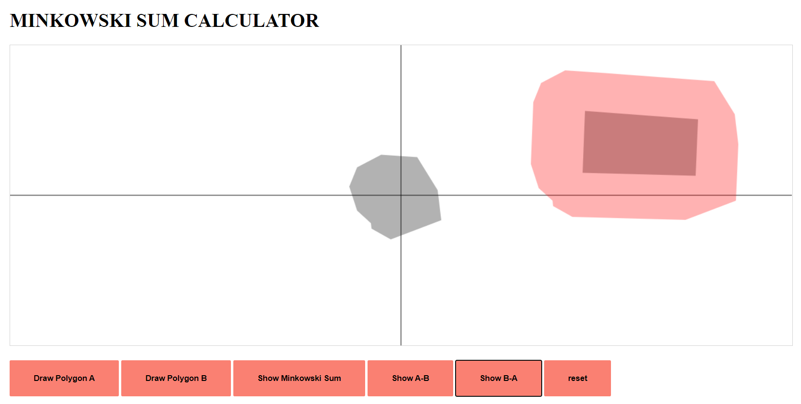

# Interactive Calculator
https://egeozgul.github.io/Minkowski-Sum-Calculator/

# Minkowski-Sum-Calculator
An interactive tool for understanding the concept of minkowski sum

Motivation:
Things are really easy when done right: I was trying to understand the concept of minkowski sum, and I read some 
textbooks and wathced some tutorials to understand it, in fact it took more than it should have to learn what it actually was since 
I am a visual learner. But there wasn't anything visual other than tutorials, so I really needed to draw arbitrary shapes and see 
their mikowski sums, but I couldn't find any quick software to do that, so I made it myself.

This is an online tool to visualize the concept of Minkowski Sum on 2D plane.
The tool allows drawing 2 polygons, and it generates the Minkowski sum and Minkowski Difference of the polygons

